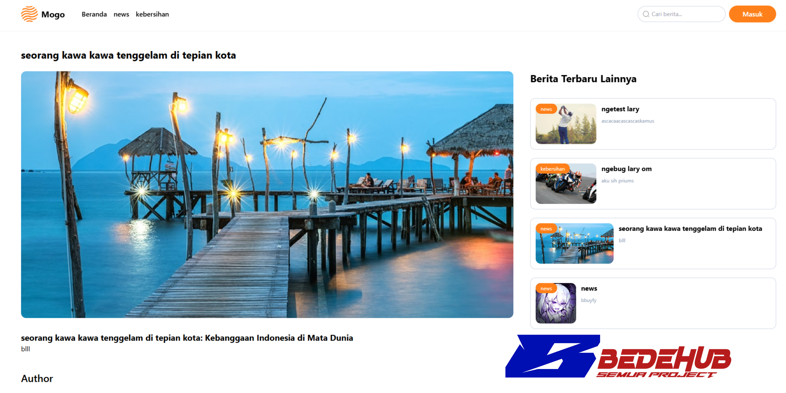
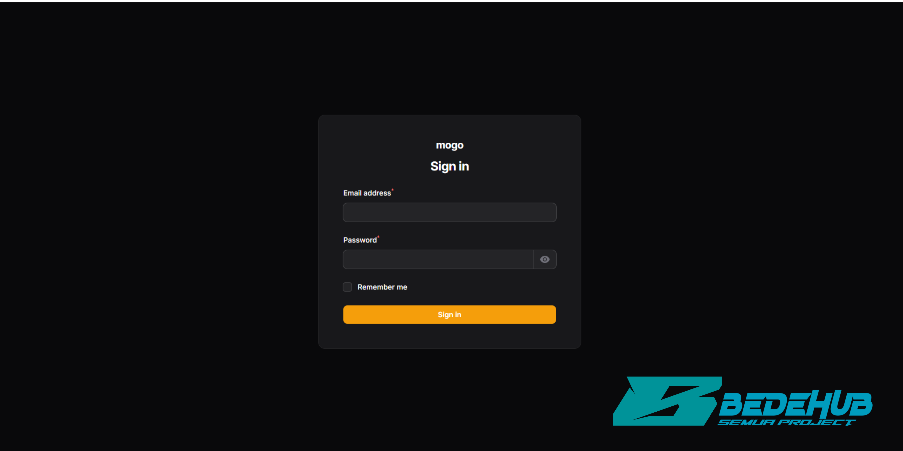
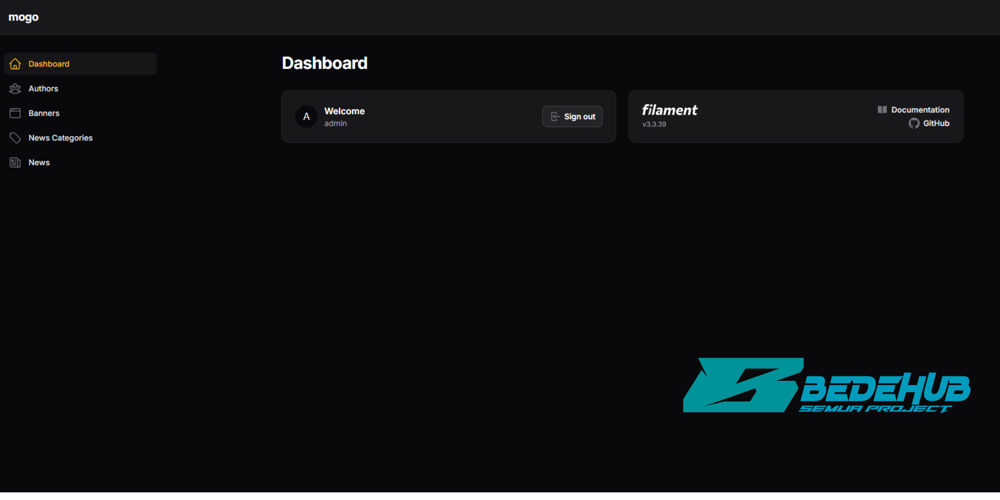
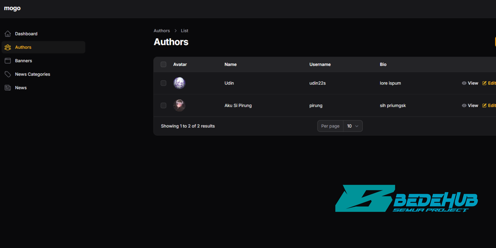
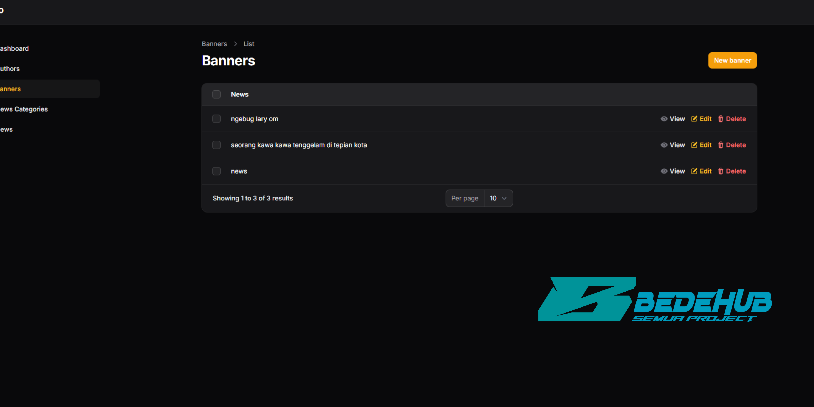
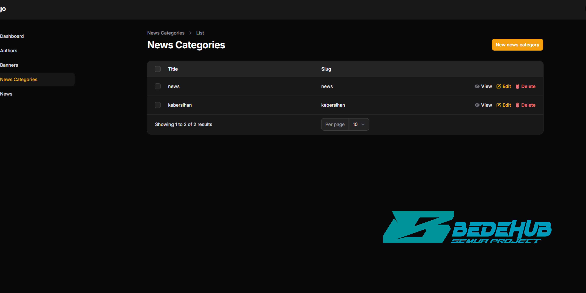
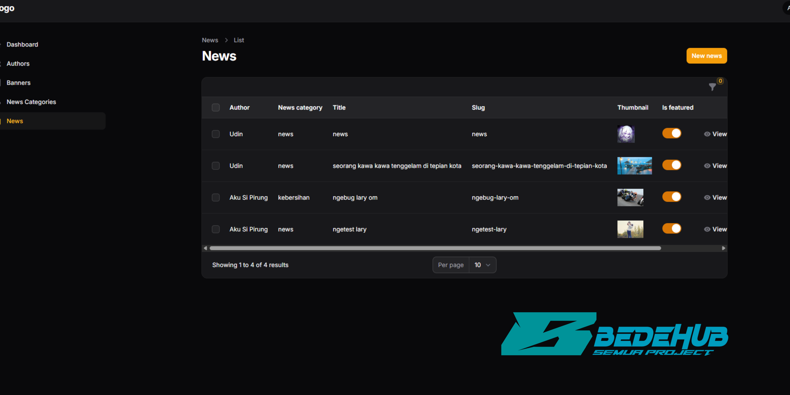

## Note ( code )

Membutuhkan Keahlian Pemrograman: Untuk dapat mengkustomisasi fitur atau memperbaiki bug yang mungkin ditemukan, Anda harus memiliki pengetahuan dasar hingga menengah dalam pemrograman, khususnya dalam Laravel, PHP, dan JavaScript. Proyek ini tidak disarankan untuk pengguna yang hanya ingin sekadar salin-tempel (copy-paste) tanpa pemahaman teknis.

- Belum Ada Otentikasi Pengguna: Proyek ini belum memiliki sistem otentikasi (login/signup) untuk pengguna umum. Semua manajemen data saat ini hanya bisa dilakukan melalui panel admin.
- Tahap Pengembangan: Proyek ini masih dalam tahap pengembangan. Beberapa fitur mungkin belum berfungsi optimal dan masih ada potensi bug yang perlu diperbaiki.
- Kode Sumber: Kode sumber ini dibuat berdasarkan tutorial dan mungkin tidak mencakup semua fitur atau perbaikan bug yang ditemukan setelah video tersebut dirilis.

## Persyaratan Sistem
Pastikan Anda sudah menginstal aplikasi berikut di sistem Anda:

- PHP (versi 8.2 atau lebih tinggi)
- Composer
- Node.js & NPM
- MySQL
- Web server (seperti XAMPP atau Laragon)

## Mogo Portal Berita dengan Laravel 12 & Filament

Mogo ini adalah sebuah website portal berita full-stack yang dibangun menggunakan Laravel 12 untuk backend dan FilamentPHP sebagai CMS (Content Management System) admin panel. Tampilan front-end (website pengguna) dibuat dari template HTML yang diintegrasikan dengan Laravel.

## Fitur Mogo Projects
- Tampilan Berita Dinamis: Menampilkan berita unggulan (featured), berita terbaru, dan daftar penulis.
- Kategori Berita: Filter berita berdasarkan kategori (misalnya: Politik, Kesehatan, Pariwisata).
- Halaman Detail Berita: Menampilkan isi berita lengkap, penulis, dan berita terkait.
- Halaman Penulis: Menampilkan profil penulis dan daftar berita yang telah mereka tulis.

## Panel Admin (Filament)
- Manajemen CRUD (Create, Read, Update, Delete) untuk Berita, Kategori Berita, Penulis, dan Banner.
- Antarmuka yang modern, responsif, dan mudah digunakan.

## Gambar Mogo Projects
 
 
 
 
 
 
 
 

## License

The Laravel framework is open-sourced software licensed under the [MIT license](https://opensource.org/licenses/MIT).
